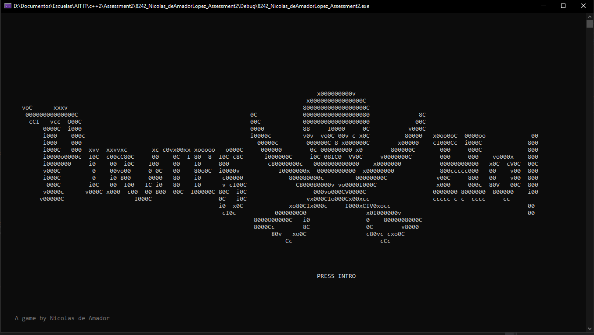
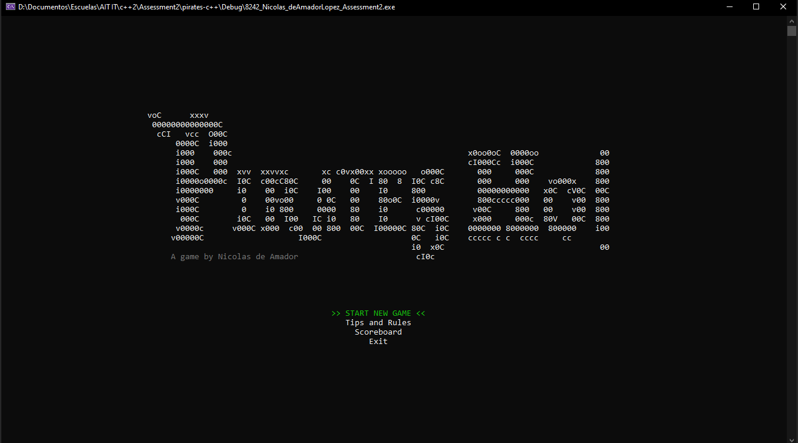
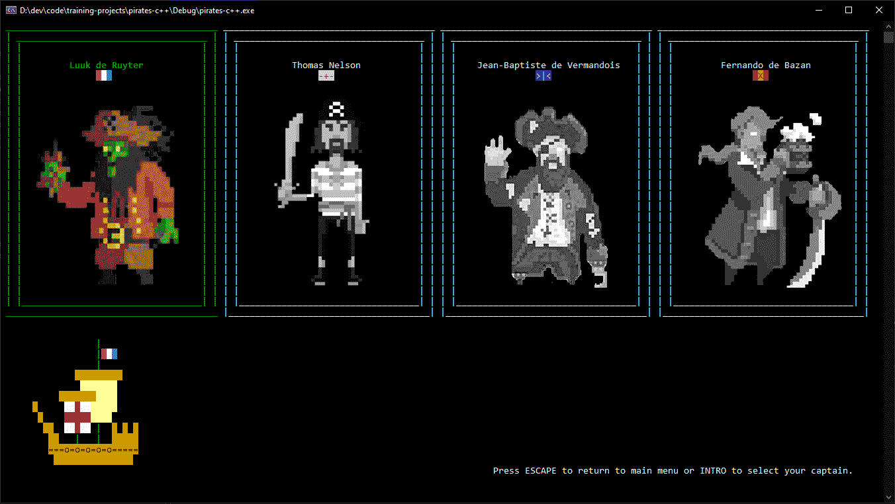

## C++ Arrow controlled console app (Pirates game)

This is just an experiment to create a c++ console app with no third party libraries which behaves like a regular arrow controlled application instead of being text based.

  
  
  
  _* placeholder art_

